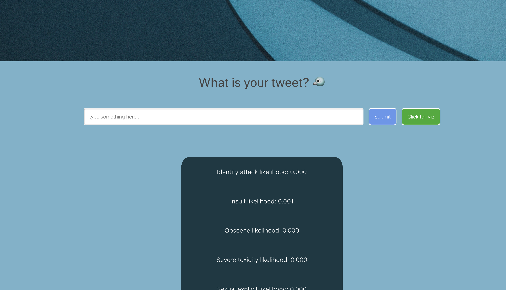

# Tweet toxicity classifier

Classifies a tweeet as toxic or not by giving the probability of it's toxicity.

Live link: 🔗 https://liyasileshi.github.io/tweet-toxicity/




## Getting Started

These instructions will get you a copy of the project up and running on your local machine for development and testing purposes.

### Prerequisites

- React
- JavaScript knowledge
- CSS
- Tensorflow js pre-trained models

### Installing

> To get started...


- **Option 1**
    - 🍴 Fork this repo!

- **Option 2**
    - 👯 Clone this repo to your local machine using `https://github.com/liyaSileshi/tweet-toxicity.git`

### Quick Start

Get up and running with Tweet toxicity app:

1. Once you have the repo cloned and met all the requirements above, start the
packager that will transform your JS code on-the-fly:
```
npm install
npm start
```

## Built With

* [React](https://reactjs.org/)
* CSS

## Authors 

* **Liya Tilahun** 

